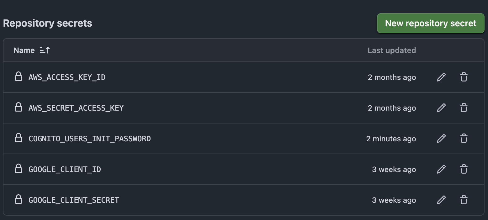
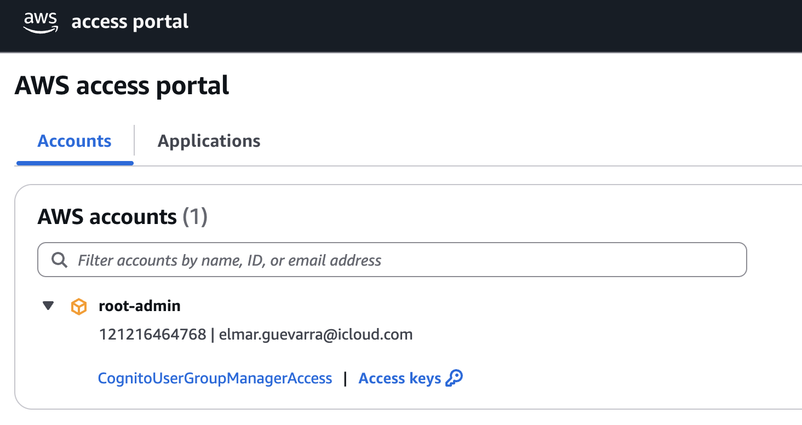

# Visitor Management System

A serverless visitor management application built with AWS SAM and Vue.js.

## 🚀 Quick Start

### Prerequisites

- **Node.js 20+**
- **AWS SAM CLI**
- **Docker** (for local DynamoDB)

### AWS Credentials Setup

To run AWS SAM and Lambda functions locally, you must configure your AWS credentials.
You can do this by running:

```bash
aws configure
```

This will prompt you for your AWS Access Key ID, Secret Access Key, region, and output format.
Make sure the credentials you use have sufficient permissions for the resources you want to test locally.

### Development Setup

```bash
# 1. Frontend (default: real backend)
cd frontend
npm install
npm run serve  # http://localhost:8080

# 1a. Frontend with MSW Mock APIs
npm run serve:msw  # http://localhost:8080 (uses MSW mocks)

# 2. Backend API
sam build
sam local start-api --env-vars env.json  # http://localhost:3000
```

## 📁 Project Structure

```
visitor-management/
├── template.yaml              # SAM infrastructure template
├── env.json                   # Backend environment variables
├── backend/src/               # Lambda functions
├── frontend/                  # Vue.js application
│   ├── .env.local             # Frontend environment variables
│   └── src/mocks/             # MSW API mocks for development
├── events/                    # SAM test events
└── infrastructure/            # CloudFormation stacks
```

## 🏗️ Architecture

**Backend**: AWS Lambda + API Gateway + DynamoDB + Cognito + Verified Permissions  
**Frontend**: Vue 3 + TypeScript + Pinia + OIDC + MSW + Bootstrap

## 🔧 Environment Variables

### Backend (`env.json` in root)

For SAM local development, configures Lambda environment variables.

### Frontend (`frontend/.env.local`)

```bash
VUE_APP_COGNITO_USER_POOL_CLIENT_ID=your-client-id
VUE_APP_COGNITO_USER_POOL_DOMAIN_URL=https://your-domain.auth.region.amazoncognito.com
VUE_APP_COGNITO_AUTHORITY_URL=https://cognito-idp.region.amazonaws.com/your-user-pool-id
VUE_APP_FRONTEND_BASE_URL=http://localhost:8080
VUE_APP_API_ENDPOINT=http://127.0.0.1:3000/
```

**Note:** Frontend variables must start with `VUE_APP_` prefix.

## 🧪 Development with MSW (Mock Service Worker)

The frontend includes MSW for API mocking during development, allowing you to work without a running backend.

### MSW Configuration

MSW is automatically enabled in development mode (`NODE_ENV === 'development'`) and provides mocks for:

- ✅ `GET /permissions` - User permissions
- ✅ `GET /visitors` - Visitor list
- ✅ `GET /visit-requests` - Visit requests
- ✅ `GET /visitor/:id` - Visitor details
- ✅ `GET /invite/:token` - Invite details
- ✅ `GET /visit-request/:token` - Visit request details
- ✅ `POST /visitor` - Create visitor
- ✅ `POST /invite` - Create invite link
- ✅ `POST /visit-request` - Create visit request

### MSW Handler Structure

```typescript
// Example: frontend/src/mocks/handlers/getVisitors.ts
export const getVisitorsHandler = (): RestHandler[] => [
  rest.get("/visitors", async (req, res, ctx) => {
    const residentId = req.url.searchParams.get("residentId");
    console.log(`[MSW] GET /visitors - residentId: ${residentId}`);
    return res(ctx.status(200), ctx.json(mockData));
  }),
];
```

### Debug Commands

```bash
# Check environment variables
echo $VUE_APP_API_ENDPOINT

# View SAM logs
sam logs --stack-name visitor-management --tail

# Test individual Lambda function
sam local invoke getVisitorsFunction --event events/event-get-visitors.json

# Check DynamoDB local tables
aws dynamodb list-tables --endpoint-url http://localhost:8000

# View browser console for MSW logs
# Look for "[MSW] Loaded with handlers 🎉" message
```

## 📝 Development Workflow

### Frontend-Only Development

1. **Use MSW mocks** (npm run serve:msw)
2. **Mock different user types** by changing `userGroup` in auth store
3. **Test UI components** without backend dependencies

### Full-Stack Development

1. **Start DynamoDB Local**: `docker run --rm -p 8000:8000 amazon/dynamodb-local`
2. **Create tables**: Use provided AWS CLI commands
3. **Start SAM API**: `sam local start-api --env-vars env.json`
4. **Update frontend env**: Set `VUE_APP_API_ENDPOINT=http://127.0.0.1:3000/`
5. **Disable MSW**: Comment out MSW initialization in `main.ts`

### Testing

```bash
# Frontend tests
cd frontend
npm run test

# Backend tests
cd backend
npm test

# E2E testing with SAM local
sam local start-api --env-vars env.json
# Then run frontend tests against local API
```

The application uses several AWS resources, including Lambda functions, an API Gateway API, an S3 Bucket with a CloudFront Distribution and Amazon DynamoDB tables. These resources are defined in the `template.yaml` file in this project. You can update the template to add AWS resources through the same deployment process that updates your application code.

This template addresses the challenge developers can face when adding a front-end to a standard serverless backend. See below for a diagram that represents a standard serverless backend:


This template adds the following components to the standard serverless backend which provides the foundation for further development of a single page app frontend to allow your users to interact with your api:


How does it work? When the full stack is deployed, the end result is a single page web application hosted on S3/CloudFront that allows users to interact with the serverless API that is created by this project.

If you prefer to use an integrated development environment (IDE) to build and test your application, you can use the AWS Toolkit.
The AWS Toolkit is an open-source plugin for popular IDEs that uses the AWS SAM CLI to build and deploy serverless applications on AWS. The AWS Toolkit also adds step-through debugging for Lambda function code.

To get started, see the following:

- [CLion](https://docs.aws.amazon.com/toolkit-for-jetbrains/latest/userguide/welcome.html)
- [GoLand](https://docs.aws.amazon.com/toolkit-for-jetbrains/latest/userguide/welcome.html)
- [IntelliJ](https://docs.aws.amazon.com/toolkit-for-jetbrains/latest/userguide/welcome.html)
- [WebStorm](https://docs.aws.amazon.com/toolkit-for-jetbrains/latest/userguide/welcome.html)
- [Rider](https://docs.aws.amazon.com/toolkit-for-jetbrains/latest/userguide/welcome.html)
- [PhpStorm](https://docs.aws.amazon.com/toolkit-for-jetbrains/latest/userguide/welcome.html)
- [PyCharm](https://docs.aws.amazon.com/toolkit-for-jetbrains/latest/userguide/welcome.html)
- [RubyMine](https://docs.aws.amazon.com/toolkit-for-jetbrains/latest/userguide/welcome.html)
- [DataGrip](https://docs.aws.amazon.com/toolkit-for-jetbrains/latest/userguide/welcome.html)
- [VS Code](https://docs.aws.amazon.com/toolkit-for-vscode/latest/userguide/welcome.html)
- [Visual Studio](https://docs.aws.amazon.com/toolkit-for-visual-studio/latest/user-guide/welcome.html)

## Deploy the sample application

The AWS SAM CLI is an extension of the AWS CLI that adds functionality for building and testing Lambda applications. It uses Docker to run your functions in an Amazon Linux environment that matches Lambda. It can also emulate your application's build environment and API.

To use the AWS SAM CLI, you need the following tools:

- AWS SAM CLI - [Install the AWS SAM CLI](https://docs.aws.amazon.com/serverless-application-model/latest/developerguide/serverless-sam-cli-install.html).
- Node.js - [Install Node.js 20](https://nodejs.org/en/), including the npm package management tool.
- Docker - [Install Docker community edition](https://hub.docker.com/search/?type=edition&offering=community).

To build and deploy your application for the first time, run the following in your shell:

```bash
sam build
sam deploy --guided
```

Create a new public certificate in us-east-1 if none
Add CNAME records from the certificate in Hosted Zone
Update Registed Domain name servers to match NS record in Hosted zone
DNS propagation can take several minutes. Wait before accessing your custom domain

The first command will build the source of your application. The second command will package and deploy your application to AWS, with a series of prompts:

- **Stack Name**: The name of the stack to deploy to CloudFormation. This should be unique to your account and region, and a good starting point would be something matching your project name.
- **AWS Region**: The AWS region you want to deploy your app to.
- **Confirm changes before deploy**: If set to yes, any change sets will be shown to you before execution for manual review. If set to no, the AWS SAM CLI will automatically deploy application changes.
- **Allow SAM CLI IAM role creation**: Many AWS SAM templates, including this example, create AWS IAM roles required for the AWS Lambda function(s) included to access AWS services. By default, these are scoped down to minimum required permissions. To deploy an AWS CloudFormation stack which creates or modifies IAM roles, the `CAPABILITY_IAM` value for `capabilities` must be provided. If permission isn't provided through this prompt, to deploy this example you must explicitly pass `--capabilities CAPABILITY_IAM` to the `sam deploy` command.
- **Save arguments to samconfig.toml**: If set to yes, your choices will be saved to a configuration file inside the project, so that in the future you can just re-run `sam deploy` without parameters to deploy changes to your application.

The following outputs will be displayed in the outputs when the deployment is complete:

- API Gateway endpoint API
- CloudFront Distribution ID
- CloudFront domain name
- S3 Bucket for Front End source files

## Deploy the Front End

For convenience, the included deploy_frontend.sh bash script can be run to automatically deploy your front end website to your AWS account. Run using the following command:

```bash
chmod +x deploy_frontend.sh
./deploy_frontend.sh
```

## Regarding CORS

For security, it is recommended to restrict the Allowed Origin value to restrict HTTP requests that are initiated from scripts running in the browser. See here for more information:

- Configuring CORS for an HTTP API - [Configuring CORS for an HTTP API](https://docs.aws.amazon.com/apigateway/latest/developerguide/http-api-cors.html).

  - e.g.

  ```javascript
  const response = {
    statusCode: 200,
    headers: {
      "Access-Control-Allow-Headers": "Content-Type",
      "Access-Control-Allow-Origin": "http://vms.alphinecodetech.click",
      "Access-Control-Allow-Methods": "OPTIONS,POST,GET,PUT",
    },
    body: JSON.stringify(item),
  };
  ```

## Use the AWS SAM CLI to build and test locally

Build your application by using the `sam build` command.

```bash
visitor-management$ sam build
```

The AWS SAM CLI installs dependencies that are defined in `package.json`, creates a deployment package, and saves it in the `.aws-sam/build` folder.

Test a single function by invoking it directly with a test event. An event is a JSON document that represents the input that the function receives from the event source. Test events are included in the `events` folder in this project.

Run functions locally and invoke them with the `sam local invoke` command.

```bash
visitor-management$ sam local invoke putVisitorFunction --env-vars env.json --event events/event-post-visitor.json
visitor-management$ sam local invoke getVisitorByIdFunction --env-vars env.json --event events/event-get-visitor-by-id.json
visitor-management$ sam local invoke getPermissionsFunction --env-vars env.json --event events/event-get-permissions.json
visitor-management$ sam local invoke getVisitRequestsFunction --env-vars env.json --event events/event-get-visit-requests.json
visitor-management$ sam local invoke getInviteByTokenFunction --env-vars env.json --event events/event-get-invite-by-token
visitor-management$ sam local invoke getVisitRequestByTokenFunction --env-vars env.json --event events/event-get-visit-request-by-token.json
visitor-management$ sam local invoke putInviteLinkFunction --env-vars env.json --event events/event-post-invite-link.json
visitor-management$ sam local invoke putVisitRequestFunction --env-vars env.json --event events/event-post-visit-request.json
visitor-management$ sam local invoke putVisitRequestFunction --env-vars env.json --event events/event-post-visit-request.json
visitor-management$ sam local invoke sendEmailFunction --env-vars env.json --event events/event-post-send-email.json

```

The AWS SAM CLI can also emulate your application's API. Use the `sam local start-api` command to run the API locally on port 3000. Don't forget to run sam build before this.

```bash
visitor-management$ sam local start-api --env-vars env.json
visitor-management$ curl http://localhost:3000/
```

The AWS SAM CLI reads the application template to determine the API's routes and the functions that they invoke. The `Events` property on each function's definition includes the route and method for each path. It also includes a reference to the API Gateway that is also deployed as part of this application.

```yaml
Events:
  Api:
    Type: Api
    Properties:
      Path: /
      Method: GET
      RestApiId:
        Ref: ApiGatewayApi
```

## Test locally with dynamodb:

1. Start DynamoDB Local in a Docker container (this example works on codespace)

```
docker run --rm -p 8000:8000 -v /tmp:/data amazon/dynamodb-local
```

2. Create the DynamoDB table (sample command below):

```bash
# Create VisitorsTable
aws dynamodb create-table \
  --table-name VisitorsTable \
  --attribute-definitions AttributeName=registrationId,AttributeType=S \
  --key-schema AttributeName=registrationId,KeyType=HASH \
  --billing-mode PAY_PER_REQUEST \
  --endpoint-url http://127.0.0.1:8000

# Create InviteLinksTable
aws dynamodb create-table \
  --table-name InviteLinksTable \
  --attribute-definitions AttributeName=inviteToken,AttributeType=S \
  --key-schema AttributeName=inviteToken,KeyType=HASH \
  --billing-mode PAY_PER_REQUEST \
  --endpoint-url http://127.0.0.1:8000

# Add TTL
aws dynamodb update-time-to-live \
  --table-name InviteLinksTable \
  --time-to-live-specification "Enabled=true, AttributeName=ttl" \
  --endpoint-url http://127.0.0.1:8000

# Create VisitRequestsTable
aws dynamodb create-table \
  --table-name VisitRequestsTable \
  --attribute-definitions AttributeName=inviteToken,AttributeType=S \
  --key-schema AttributeName=inviteToken,KeyType=HASH \
  --billing-mode PAY_PER_REQUEST \
  --endpoint-url http://127.0.0.1:8000

# Add TTL
aws dynamodb update-time-to-live \
  --table-name VisitRequestsTable \
  --time-to-live-specification "Enabled=true, AttributeName=ttl" \
  --endpoint-url http://127.0.0.1:8000
```

3. Retrieve the ip address of your docker container running dynamodb local:

```
docker inspect 329a73cbfc1fd07d04bb4cb2b069fa8d790fc76aa32d6476b9e57f93a1941eb7 -f  '{{range .NetworkSettings.Networks}}{{.IPAddress}}{{end}}'

```

4. Update env.json with the IP of your docker container for the endpoint override - see here for example:

```
{
    "getByIdFunction": {
        "DB_ENDPOINT_OVERRIDE": "http://172.17.0.2:8000",
        "VISITOR_TABLE": "VisitorsTable"
    },
    "putItemFunction": {
        "DB_ENDPOINT_OVERRIDE": "http://172.17.0.2:8000",
        "VISITOR_TABLE": "VisitorsTable"
    }
}
```

5. run the following commands to start the sam local api:

```
sam local start-api --env-vars env.json --host 0.0.0.0 --debug
```

6. For testing - you can put an item into dynamodb local

```
aws dynamodb put-item \
    --table-name VisitorsTable \
    --item '{"registationId": {"S": "A1234"}, "visitorName": {"S": "randeepx"}}' \
    --endpoint-url http://127.0.0.1:8000
```

7. How to scan your table for items

```
aws dynamodb scan --table-name VisitorsTable --endpoint-url http://127.0.0.1:8000
```

8. To run frontend application locally:
   Go to your `frontend` code directory

```
cd frontend
```

Make backend API endpoint accessible as an environment variable. For local, create a `.env` file, Here is an example:

```
VUE_APP_API_ENDPOINT=http://127.0.0.1:3000/
```

9. run following command to compile and run (with hot-reloads) for development

```
npm run serve
```

10. to execute frontend unit test

```
npm run test
```

## Add a resource to your application

The application template uses AWS SAM to define application resources. AWS SAM is an extension of AWS CloudFormation with a simpler syntax for configuring common serverless application resources, such as functions, triggers, and APIs. For resources that aren't included in the [AWS SAM specification](https://github.com/awslabs/serverless-application-model/blob/master/versions/2016-10-31.md), you can use the standard [AWS CloudFormation resource types](https://docs.aws.amazon.com/AWSCloudFormation/latest/UserGuide/aws-template-resource-type-ref.html).

Update `template.yaml` to add a dead-letter queue to your application. In the **Resources** section, add a resource named **MyQueue** with the type **AWS::SQS::Queue**. Then add a property to the **AWS::Serverless::Function** resource named **DeadLetterQueue** that targets the queue's Amazon Resource Name (ARN), and a policy that grants the function permission to access the queue.

```
Resources:
  MyQueue:
    Type: AWS::SQS::Queue
  getUserItemsFunction:
    Type: AWS::Serverless::Function
    Properties:
      Handler: src/handlers/get-user-items.getUserItemsHandler
      Runtime: nodejs20.x
      DeadLetterQueue:
        Type: SQS
        TargetArn: !GetAtt MyQueue.Arn
      Policies:
        - SQSSendMessagePolicy:
            QueueName: !GetAtt MyQueue.QueueName
```

The dead-letter queue is a location for Lambda to send events that could not be processed. It's only used if you invoke your function asynchronously, but it's useful here to show how you can modify your application's resources and function configuration.

Deploy the updated application.

```bash
visitor-management$ sam deploy
```

Deploy the Frontend

```bash
visitor-management$ ./deploy_frontend.sh
```

Open the [**Applications**](https://console.aws.amazon.com/lambda/home#/applications) page of the Lambda console, and choose your application. When the deployment completes, view the application resources on the **Overview** tab to see the new resource. Then, choose the function to see the updated configuration that specifies the dead-letter queue.

## Fetch, tail, and filter Lambda function logs

To simplify troubleshooting, the AWS SAM CLI has a command called `sam logs`. `sam logs` lets you fetch logs that are generated by your Lambda function from the command line. In addition to printing the logs on the terminal, this command has several nifty features to help you quickly find the bug.

**NOTE:** This command works for all Lambda functions, not just the ones you deploy using AWS SAM.

```bash
visitor-management$ sam logs -n putItemFunction --stack-name visitor-management --tail --region ap-southeast-1
```

To get all logs

```bash
visitor-management$ sam logs --stack-name visitor-management --tail --region ap-southeast-1

```

**NOTE:** This uses the logical name of the function within the stack. This is the correct name to use when searching logs inside an AWS Lambda function within a CloudFormation stack, even if the deployed function name varies due to CloudFormation's unique resource name generation.

You can find more information and examples about filtering Lambda function logs in the [AWS SAM CLI documentation](https://docs.aws.amazon.com/serverless-application-model/latest/developerguide/serverless-sam-cli-logging.html).

## Unit tests

Tests are defined in the `__tests__` folder in this project. Use `npm` to install the [Jest test framework](https://jestjs.io/) and run unit tests.

```bash
visitor-management$ npm install
visitor-management$ npm run test
```

```bash
sam delete --stack-name visitor-management
```

## Deployment Pre-requisites

### Secrets

Configure the Secrets In Repository Actions



## Operational Configuration

This system uses AWS console as user management system. An AWS console user called `workforce identity` under the root user should be created to manage users e.g. group assignment.

### Create Workforce Identities

Users can be organized into groups, and permission sets are assigned to these groups (or directly to users) to grant them access to specific AWS accounts within your AWS Organization and to applications.

Make sure you are in the right region

1. In AWS console go to IAM/Policies
2. Creae a policy named `CognitoUserPoolUserAndGroupManagerPolicy` with the following permissions
   ```json
   {
     "Version": "2012-10-17",
     "Statement": [
       {
         "Sid": "VisualEditor0",
         "Effect": "Allow",
         "Action": [
           "cognito-idp:AdminDeleteUser",
           "cognito-idp:ListUsersInGroup",
           "cognito-idp:DescribeUserPool",
           "cognito-idp:ListGroups",
           "cognito-idp:AdminDisableUser",
           "cognito-idp:AdminRemoveUserFromGroup",
           "cognito-idp:AdminAddUserToGroup",
           "cognito-idp:AdminListGroupsForUser",
           "cognito-idp:AdminGetUser",
           "cognito-idp:AdminResetUserPassword",
           "cognito-idp:ListUserImportJobs",
           "cognito-idp:ListUsers"
         ],
         "Resource": "arn:aws:cognito-idp:ap-southeast-1:121216464768:userpool/ap-southeast-1_Riz1Rkjzd"
       },
       {
         "Sid": "VisualEditor1",
         "Effect": "Allow",
         "Action": "cognito-idp:ListUserPools",
         "Resource": "*"
       }
     ]
   }
   ```
3. In AWS console go to IAM Identity Center/Users then Add user named `cognito-user-admin`
4. On the left side pane go to Permission sets then attach the custom policy `CognitoUserPoolUserAndGroupManagerPolicy`
5. On the left side pane go to AWS accounts attach the permission set to `cognito-user-admin`
6. On the left side pane go to Settings then get the `AWS access portal URL` (e.g.`https://d-9667b2f6d3.awsapps.com/start`). This is where the admin of system can login to manage other system users



## Cleanup

To delete the sample application that you created, use the AWS CLI. Assuming you used your project name for the stack name, you can run the following:

Manually empty the s3 bucket

## TODO

Update Readme to add about Google login and the configuration in Google Cloud Console.

## Resources

For an introduction to the AWS SAM specification, the AWS SAM CLI, and serverless application concepts, see the [AWS SAM Developer Guide](https://docs.aws.amazon.com/serverless-application-model/latest/developerguide/what-is-sam.html).

Next, you can use the AWS Serverless Application Repository to deploy ready-to-use apps that go beyond Hello World samples and learn how authors developed their applications. For more information, see the [AWS Serverless Application Repository main page](https://aws.amazon.com/serverless/serverlessrepo/) and the [AWS Serverless Application Repository Developer Guide](https://docs.aws.amazon.com/serverlessrepo/latest/devguide/what-is-serverlessrepo.html).

## 🚦 Deployment Guide

All AWS resources for this project—including Lambda functions, API Gateway, DynamoDB tables, Cognito, SES identities, and templates—are automatically created and managed by the provided CloudFormation/SAM templates.

However, the following steps require manual action on first deploy or when adding a new domain:

### ⚠️ Note on Hosted Zone Creation

Creating a new Route 53 hosted zone (for DNS management) incurs a recurring cost. Only create a hosted zone if you do not already have one for your domain. Double-check your AWS account to avoid unnecessary charges.

### 1. Create Public Certificate for Website Domain

- Manually create a public ACM certificate in the `us-east-1` region for your domain (e.g., `yourdomain.com`, `*.yourdomain.com`).
- After creating the certificate, add the required DNS validation records to your domain's DNS/Route53.
- Wait for the certificate to be validated before proceeding with deployment.
- Update your deployment scripts or parameters with the ARN of the validated certificate.

### 2. Use a Custom Domain for Email Notifications (Apple iCloud+, Google Workspace, Fastmail, Zoho, Proton Mail, etc.)

To send notification emails with a "from" address using your own domain (e.g., `you@yourdomain.com`), you can use a custom domain email provider. Popular options include:

- **Apple iCloud+** (Custom Email Domain)
- **Google Workspace (Gmail for Business)**
- **Fastmail**
- **Zoho Mail**
- **Proton Mail**
- **Namecheap Private Email**
- **Mailbox.org**
- **Migadu**
- ...and others

#### General Steps for Any Provider

1. Set up your domain with your chosen provider (e.g., Apple ID > iCloud+ > Custom Email Domain, or Google Admin Console for Google Workspace).
2. Your provider will give you DNS records (MX, TXT, CNAME for DKIM, etc.) to add to Route 53. For Apple iCloud+, these are already included in the provided record set template:
   - MX records for mail delivery
   - TXT records for domain verification and SPF
   - CNAME records for DKIM
3. After adding these records and verifying your domain with your provider, you can use your custom domain as the "from" address for SES notifications.

### 2a. Add New Custom Domain Email Addresses (Apple iCloud+ and Similar Services)

After completing the DNS and verification steps above, you can add new email addresses with your custom domain in your provider's dashboard (e.g., Apple iCloud+ > Custom Email Domain > Add Email Address). For example, you can add `info@alphinecodetech.click` or any other address under your domain.

Once added and verified, you can use these addresses as the "from" address in SES notification emails.

#### Supported Providers for Custom Domain Email (examples):

- **Apple iCloud+** (Custom Email Domain)
- **Google Workspace (Gmail)**
- **Fastmail**
- **Zoho Mail**
- **Proton Mail**
- **Microsoft 365/Outlook**
- ...and other providers that support custom domain email addresses

Just ensure the DNS records (MX, TXT, DKIM, etc.) required by your provider are present in Route 53, and the address is verified in both your provider and SES if needed.

### 3. Move SES to Production

#### SES Sandbox vs Production

By default, AWS SES starts in sandbox mode. In sandbox mode, you can only send emails to verified addresses and have low sending limits. For real-world use, you must move SES to production mode.

- Deploy all SES resources (identities, templates) using the provided CloudFormation/SAM templates.
- Go to the AWS SES Console for your region.
- In the left menu, select **Account dashboard**.
- Publish the DNS record to Route53.
- Complete all the tasks.
- Click **Request production access**.
- Fill out the form, describing your use case and how you prevent spam/abuse.
- Submit the request and wait for AWS approval (may take a few days).

Once approved, you can send emails to any address without verifying each recipient.

---
